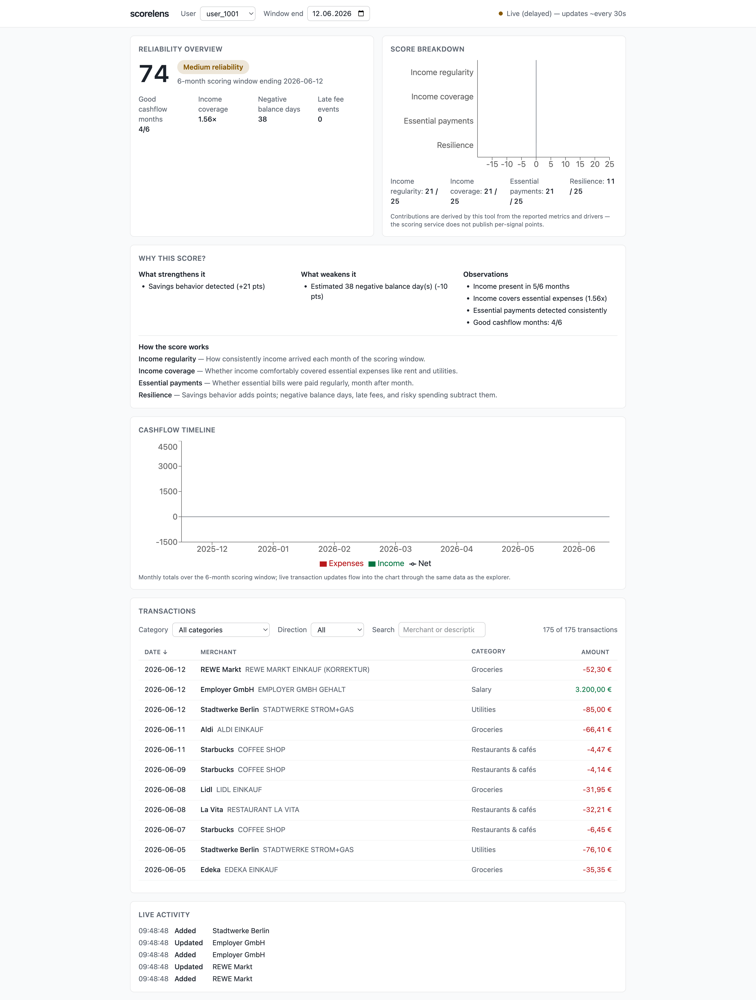

# scorelens

**Live: _deployment pending — see [Deployment](#deployment)_**

Explainable reliability scoring for risk analysts. scorelens visualizes a Reliability
Index (0–100) computed from bank transaction data — score overview, signal breakdown,
transaction explorer, cashflow timeline, plain-language explanations, and a live
transaction stream — so analysts can understand how a score was computed, inspect the
underlying transactions, and validate that the scoring system behaves correctly.



## What it does

- **Reliability overview** — score, band (color always paired with text), scoring
  window, key metrics
- **Score breakdown** — the four scoring signals as point contributions toward the
  final score, derived transparently from reported metrics ([why "derived"](#assumptions-trade-offs-limitations))
- **Why this score?** — the backend's drivers split into strengths, risks, and
  observations, plus plain-language copy explaining each signal
- **Transaction explorer** — virtualized grid over the full windowed dataset:
  category/direction filters, debounced merchant search, keyboard-sortable columns
- **Cashflow timeline** — monthly income/expense bars and net line over the same data
- **Live updates** — the stream feeds every panel through one normalized record; an
  honest status indicator (`live | delayed | reconnecting | offline`) and an activity
  feed of applied events
- **Resilience** — every panel renders loading/empty/error through one shared
  component; offline shows recoverable errors and self-heals on reconnection

## Getting started

Requires Node 22+.

```sh
make install   # dependencies + git hooks
cp .env.example .env
make dev       # dev server
```

## Development

| Action                                      | Command      |
| ------------------------------------------- | ------------ |
| Local gates (typecheck + lint + tests)      | `make test`  |
| Production build                            | `make build` |
| Regenerate API types from the spec snapshot | `make types` |
| All targets                                 | `make help`  |

## Configuration

Two environment variables, validated and frozen at startup by `src/config.ts`
(the app fails fast with a clear error if either is missing or malformed):

| Variable            | Purpose                           |
| ------------------- | --------------------------------- |
| `VITE_API_BASE_URL` | REST API base URL                 |
| `VITE_SSE_BASE_URL` | Transaction event stream base URL |

Both are public, unauthenticated endpoints. Never put secrets in `VITE_*` vars —
Vite inlines them into the public bundle.

## Architecture

Feature slices over a shared data core, with lint-enforced import direction. The load
is a sequential paginated fill into a normalized `Record<id, Transaction>` in the
TanStack Query cache; the stream applies events to the same record through a pure,
idempotent reducer — which is why live updates reach the explorer, the chart, and the
score with no per-feature wiring. The stream is an optimization; REST is the truth.

Diagrams and the full data-flow story: [docs/architecture.md](docs/architecture.md).
Every locked decision has an ADR: [docs/decisions.md](docs/decisions.md). The backend
was probed before any code was written: [docs/api/findings.md](docs/api/findings.md).

## Testing

Strict TDD on the correctness-critical core — the event reducer (16-case matrix:
duplicates, out-of-order, unknown-id update/delete, reference stability), the SSE wire
parser (CRLF, multi-`data:`, chunk reassembly), the pagination loop, the derive
pipeline, monthly aggregation, config validation, store actions — pragmatic
test-after for components. MSW at the network boundary and a mock fetch-stream for the
transport; tests never touch the live API. One axe smoke test guards the assembled view.

183 tests; enforced coverage thresholds: `api/` 90/85, `utils/` + `domain/` 95/90,
`state/` 90/85 (lines/branches).

## Performance

- Largest live dataset: **631 transactions** (full range) / ~174 in a scoring window.
  The architecture is engineered well past that: a dev-only stress mode pushes
  **25,000 synthetic rows** through the production pipeline — constant ~23 row DOM,
  11.2ms average frame under worst-case scroll
  ([evidence](docs/assets/explorer-stress-25k.png))
- Single-row stream updates re-render exactly the affected rows — measured zero
  re-renders across 174 unaffected rows during a live cycle
  ([evidence](docs/assets/explorer-live.png))
- Memoization only on three designated hot paths (row, derive pipeline, SSE write
  path); everything else is plain React. Lighthouse on the production build:
  Accessibility 100, Best Practices 100, SEO 100 ([report](docs/assets/lighthouse/report.html))

## Observability

Every observable event flows through one seam — `src/utils/log.ts` (ADR-15). Production
hardening (Sentry, OpenTelemetry, web-vitals) is a transport swap in that file, not a
refactor. What it emits today, to the console:

| Event                            | Payload                                                               | When                                          |
| -------------------------------- | --------------------------------------------------------------------- | --------------------------------------------- |
| `transactions.fill`              | userId, pages, total, durationMs                                      | every paginated fill completes                |
| `stream.connected`               | userId, path (`streaming`/`envelope`), recovering                     | each stream connection                        |
| `stream.cycle`                   | userId, delivered                                                     | clean productive cycle ends                   |
| `stream.suspect-cycle` (warn)    | userId, failedAttempts                                                | fast-empty cycle routed through backoff       |
| `stream.error` (warn)            | userId, failedAttempts, message                                       | connection failure before backoff             |
| `stream.reconciled`              | userId, reason (`recovery` / `safety-interval` / `visibility-resume`) | every REST reconcile, with why                |
| `stream.closed`                  | userId                                                                | connection ownership released                 |
| `app.error` (error)              | message, componentStack, selectedUserId, windowFrom, streamStatus     | ErrorBoundary catch — the incident payload    |
| `profiler.row-render` (dev only) | transaction id                                                        | render-count instrument for the one-row claim |

**Incident walkthrough** — "the UI looks wrong or slow in production":

1. **Status indicator** (header): is the stream `live`, `delayed`, `reconnecting`, or `offline`?
   That immediately splits data-freshness incidents from rendering incidents.
2. **Log timeline**: the `stream.*` sequence shows exactly when connections cycled, failed,
   and reconciled — and `transactions.fill` shows whether REST refetches are slow or failing.
3. **Render behavior**: `profiler.row-render` (dev) counts exactly which rows re-render;
   a misbehaving memo or derive shows up as row spam. The React Profiler confirms.
4. ErrorBoundary crashes arrive as one structured `app.error` payload carrying the client
   state a responder needs first: which user/window was on screen and what the stream was doing.

## Assumptions, trade-offs, limitations

- **The stream endpoint is buffered as deployed.** The Lambda Function URL returns each
  ~30s event cycle as one JSON envelope instead of incremental SSE (measured:
  [findings §6](docs/api/findings.md)). The transport handles both shapes; today it
  runs degraded and the UI says so — `Live (delayed) — updates ~every 30s`. The moment
  the backend enables response streaming, real-time works with zero code change (ADR-17).
- **Signal contributions are derived, and the UI says so.** The API reports raw metrics
  and prose drivers, not per-signal points. The derivation is exact for all observed
  live data (sum equals the reported score), parses resilience from the backend's own
  "(±N pts)" annotations, and surfaces anything unattributable as visible text. It is
  coupled to the driver-string format; if that format changes, resilience degrades to
  zero and the residual note appears — graceful, not silent.
- **Stream payload field integrity is delegated to the backend contract** — events are
  validated for shape (id presence, typed discriminants), not field-by-field.
- **Zero-amount transactions** match neither direction filter ("Money in"/"Money out");
  none exist in live data.
- **First-load status reads `Offline`** for up to ~30s while the first buffered cycle
  is in flight — the status vocabulary has no `connecting` state (a deliberate
  four-state design; adding a fifth is the named follow-up).
- **Reconnects refetch the full window** rather than a delta — acceptable at hundreds
  of rows; delta endpoints or server-supported resume are the scaling knob (ADR-05).
- **Derive-timing events named in ADR-15 are not wired** — render-layer evidence
  comes from the dev-gated render-count instrumentation (`profiler.row-render`).
- **Future-dated data is normal** — the dataset runs to 2027-06; no date logic assumes
  `date <= today`.

## Discussion

Written answers to the seven architecture topics, each linking to the decision records
([docs/decisions.md](docs/decisions.md)) and evidence that ground them.

### API Design & Evolution

The contract is pinned and machine-checked: the OpenAPI spec is committed as a
snapshot ([docs/api/openapi.yaml](docs/api/openapi.yaml)) and TypeScript types are
generated from it (ADR-07), so an evolved contract becomes a regenerate-and-compile
diff rather than a runtime surprise. New data is additive by design: rendering
iterates registries keyed by API ids, and unknown ids render through a neutral
fallback instead of crashing — a new category or score band appears (unstyled) the
day the backend ships it, and becomes first-class with one registry entry (ADR-12).
The breakdown's unknown-signal fallback is implemented and test-pinned, ready for the
day signal data ships from the API rather than being derived client-side. This wasn't
theoretical: the deployed SSE endpoint already diverged from its nominal contract,
and the dual-path transport (ADR-17) is the worked example of absorbing contract
drift without blocking on the backend.

### Data Ownership & Boundaries

The backend owns scoring semantics and numeric truth; this frontend owns presentation
and clearly-labeled projections of that truth (the visible transaction set, monthly
cashflow aggregation, derived signal contributions — marked as derived by this tool,
never presented as API output). Validation reflects the same boundary: payloads from
the trusted backend get shallow structural checks, not deep revalidation (a
deliberate trade-off, documented at the type guard). The REST host is itself a BFF
proxying an upstream banking API ([findings §1](docs/api/findings.md)), which is the
right place for cross-cutting concerns; at scale, filtering and aggregation migrate
behind that boundary too.

### Data Consistency & Correctness

Out-of-order data is solved by construction rather than by handling: transactions
live in a normalized record keyed by id, wire order carries no meaning, and display
order is always derived (ADR-03). Stream events apply through a pure, idempotent
reducer (16 tested cases — duplicates, unknown-id updates, delete-before-add are all
defined behavior). The stream is treated as an optimization and REST as the truth
(ADR-05/17): recovery reconnects trigger reconciliation, clean envelope cycles don't
(they carried the events), and a low-frequency safety reconcile in degraded mode
catches drift. Score and transactions can't diverge visibly: transaction mutations
debounce-invalidate the reliability query.

### Scalability (100K+ transactions)

The seams are placed where this evolution cuts. What changes: filtering/search/sort
move server-side, the full-fetch becomes windowed/infinite loading, filters move into
query keys, and the stream needs server-supported resume or delta endpoints instead
of full-refetch reconciliation. What survives unchanged: normalization,
virtualization (already proven at 25,003 synthetic rows — DOM constant at 23
elements, 11.2ms average frame, p95 25ms), the derive discipline (shrinking to
presentation-only), and the pure event reducer. ADR-04 records the pivot conditions
explicitly — this codebase knows which of its decisions are load-bearing and which
are scale-bounded.

### Real-Time Updates

The design assumes gaps are normal, because the transport can't promise otherwise
(stateless Lambda, no replay). That produces the central rule: the stream keeps the
UI fresh _between_ reconciliations; REST remains authoritative (ADR-05). The UI never
overstates freshness — when the deployed endpoint delivers buffered batches, the
indicator says "delayed" with the measured cadence, not "live." For higher
frequencies, the next steps are already seamed: batched cache writes per animation
frame, and the no-op-returns-same-reference reducer property already guarantees that
irrelevant events cost zero renders.

### Caching & Performance

TanStack Query is the cache, and the invalidation map is explicit (ADR-02): user or
window changes are new query keys (no invalidation needed); recovery reconnects
invalidate transactions; transaction mutations debounce-invalidate reliability;
degraded mode adds a low-frequency safety reconcile. Filters deliberately stay out of
query keys — they're synchronous client-side derives, so a filter change costs zero
network. Render performance follows a written policy (ADR-13): exactly three
designated hot paths are memoized (virtualized rows, the derive pipeline, the stream
write path), each with measured evidence rather than speculative useMemo — a live
stream cycle re-rendered zero of 174 unaffected rows.

### Incident Thinking

The app ships its own debugging instruments (ADR-15): a structured logging seam
(stream lifecycle with attempt counts, fetch-loop pages and durations, dev-gated
render-count instrumentation), an ErrorBoundary that captures a structured payload
(selection state, last stream status), and the stream status indicator as the first
triage signal — the full inventory is in [Observability](#observability). "Slow"
bisects along the log seams — data layer (fetch/stream timings) versus render layer
(Profiler, the same method used to capture this repo's performance evidence).
"Incorrect" starts at reconciliation: force a refetch, diff against the
stream-applied state. Production hardening is a transport swap at the log seam
(Sentry, web-vitals), not a refactor. This isn't hypothetical either — the SSE
endpoint misconfiguration was diagnosed with exactly this method: observe, measure
byte timing, isolate root cause, and design around it
([findings §6](docs/api/findings.md)).

## Deployment

Static Vite SPA, deployable on Vercel:

- Framework preset: **Vite** (build `npm run build`, output `dist/`)
- Environment variables: `VITE_API_BASE_URL`, `VITE_SSE_BASE_URL` (values in
  `.env.example`)
- No rewrites needed (single page, no router)

## Documentation

- [`docs/architecture.md`](docs/architecture.md) — component/data-flow and stream
  lifecycle diagrams
- [`docs/decisions.md`](docs/decisions.md) — architecture decision records
- [`docs/api/findings.md`](docs/api/findings.md) — live API verification evidence
- [`docs/api/openapi.yaml`](docs/api/openapi.yaml) — committed API spec snapshot
- [`docs/ai-workflow.md`](docs/ai-workflow.md) — how AI assistance was used to build
  this project
