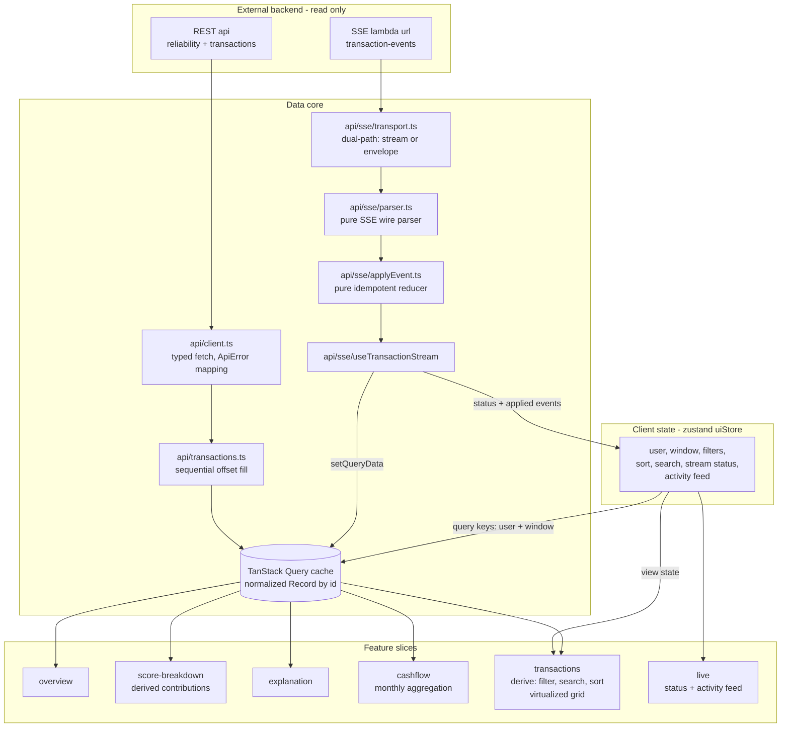
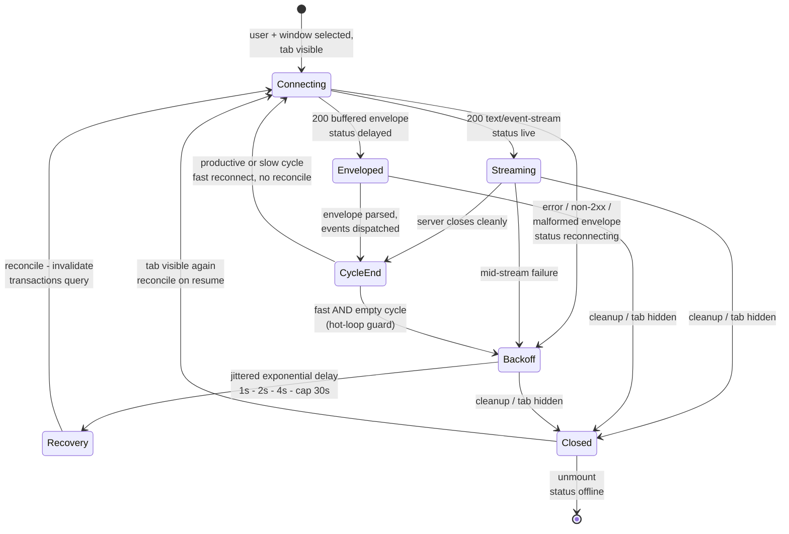

# Architecture

How scorelens is put together, and why streamed updates propagate everywhere "for free".
The reasoning behind each decision lives in [decisions.md](./decisions.md); live API
evidence in [api/findings.md](./api/findings.md).

## Component and data flow

One write path feeds many read paths: the paginated REST fill and the SSE stream both
land in the same normalized `Record<transactionId, Transaction>` inside the TanStack
Query cache. Every feature is a projection of that record (or of the reliability
response), so a single applied stream event updates the explorer, the cashflow chart,
and — via debounced invalidation — the score, with no feature-level wiring.

Key invariants (lint- and review-enforced):

- **Query keys come from client state only** — `['transactions', userId, windowFrom]`.
  Filters, search, and sort never enter keys; they are synchronous client-side derives.
- **Arrays never persist** — wire order is meaningless (the API shuffles deliberately);
  order is derived at projection boundaries, sorted by `(date, id)`.
- **Server data never enters Zustand** — uiStore holds analyst choices and the ephemeral
  activity feed; the litmus test is "on reload, is it re-fetched or re-chosen?"
- **Import direction** — features → data core → leaf utilities, enforced by ESLint zones.

## Stream lifecycle

The deployed SSE endpoint buffers each ~30s scripted cycle into a Lambda JSON envelope
(measured in [findings §6](./api/findings.md)), so the transport is dual-path (ADR-17):
it consumes real `text/event-stream` incrementally when offered, and unwraps the
envelope otherwise. Either way the same typed events flow through the same pure reducer.

Clean cycles are the normal loop — prompt reconnect, no reconciliation (the stream
carried the events). Only errors and abnormal termination take the recovery route:
exponential backoff, then a REST reconcile on the next successful connection. A
low-frequency safety reconcile catches drift across degraded-mode cycles, and REST
remains the single source of truth throughout (ADR-05).

Event semantics in the reducer (`applyEvent`, strict-TDD, 16-case matrix): ADDED and
UPDATED are both upserts (an UPDATED for an unknown id carries a complete payload — it
is an add); DELETED of an unknown id is a no-op returning the same reference. No-ops
produce zero cache writes and therefore zero renders; `synced_at` is excluded from
equality because the server re-stamps it per cycle. The live activity feed shows only
applied events — replays are visible by their absence.

## Performance model

Exactly three designated hot paths are memoized (ADR-13); everything else is plain React:

1. **`TransactionRow`** — `React.memo` fed stable references from the normalized record.
   Measured live: across a full stream cycle, zero of 174 existing rows re-rendered.
2. **The derive pipeline** — memoized filter→search→sort and chart `data` arrays
   (stable references prevent chart re-animation).
3. **The SSE write path** — no-op events return the same record reference.

The grid is virtualized (TanStack Virtual, grid semantics preserved): 25,000 synthetic
rows through the production pipeline hold the DOM at ~23 row elements with an 11.2ms
average frame ([stress evidence](./assets/explorer-stress-25k.png)).
